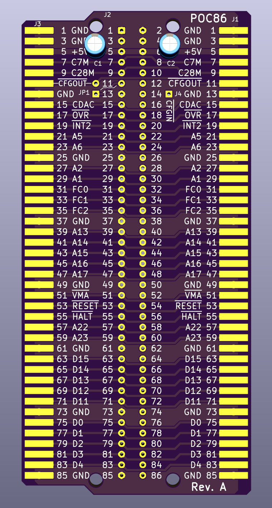
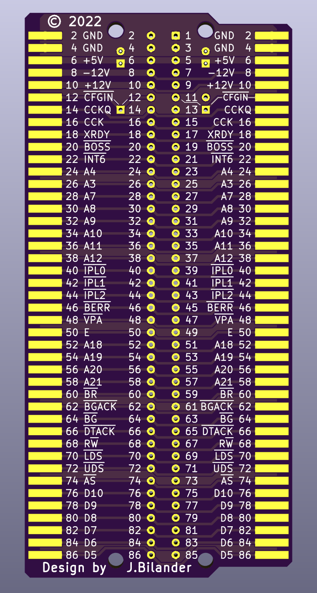
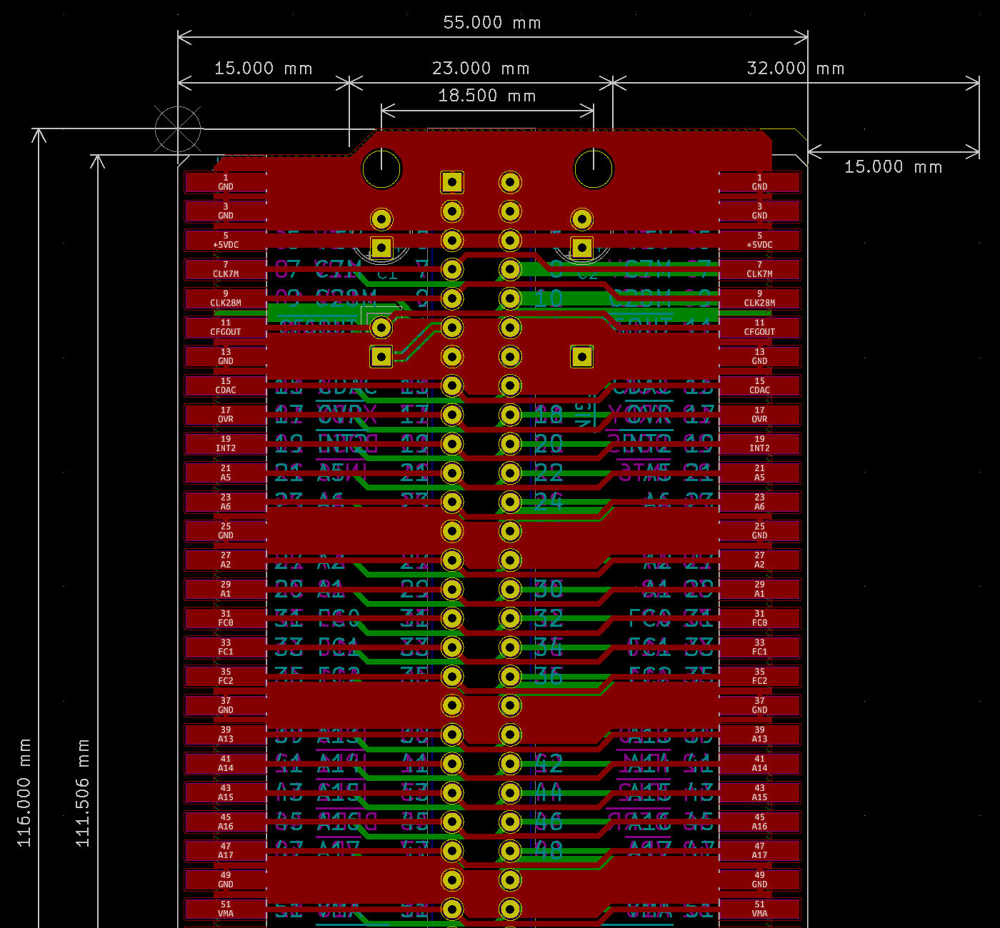
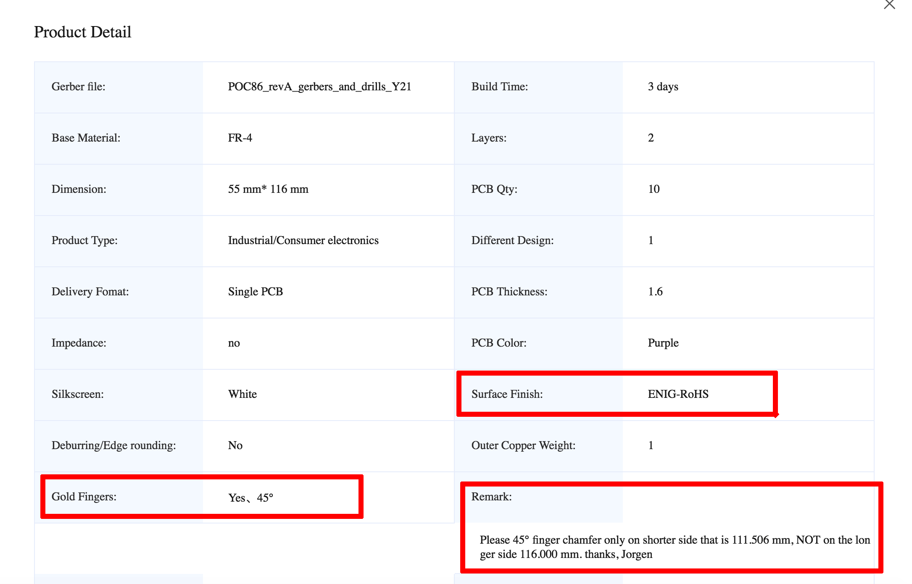
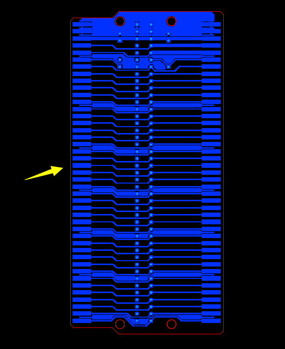

# POC86
PortZ Of Call 86 - An external co-processor slot for the A500 with a pass-through expansion edge.

FRONT SIDE &emsp;&emsp;&emsp;&emsp;&emsp;&emsp;&emsp;&emsp;&emsp;&emsp;&emsp;&emsp;&emsp; UNDER SIDE 

***

86-pin connectors can be sourced from here: 
https://www.aliexpress.com/item/33029711948.html

***

***
When ordering make sure you select ENIG and goldfingers + send note about chamfering only on one side.
 
 

***

[![CC BY-SA 4.0][cc-by-sa-shield]][cc-by-sa]

This work is licensed under a
[Creative Commons Attribution-ShareAlike 4.0 International License][cc-by-sa].

[![CC BY-SA 4.0][cc-by-sa-image]][cc-by-sa]

[cc-by-sa]: http://creativecommons.org/licenses/by-sa/4.0/
[cc-by-sa-image]: https://licensebuttons.net/l/by-sa/4.0/88x31.png
[cc-by-sa-shield]: https://img.shields.io/badge/License-CC%20BY--SA%204.0-lightgrey.svg
